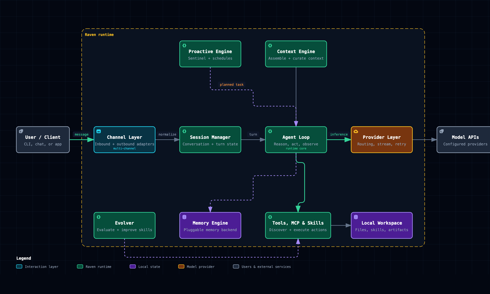

# Raven × Archify：从真实仓库生成可验证架构地图

[English](README.md)

## 结论

在 Raven 中，Archify 的正确使用方式是安装为本地 **Skill**。

但不要直接把官方首页的下面这条通用命令当成 Raven 安装命令：

```bash
npx skills add tt-a1i/archify -g
```

Archify 官方文档明确说明：当前 Agent 切换器只支持 Cursor、Codex、
Claude Code 和 OpenCode，**Raven 不是切换器目标**。Raven 要使用官方打包的
`archify.zip`，解压后最终目录必须是：

```text
~/.raven/workspace/skills/archify/SKILL.md
```

安装完成后，Raven 读取 `SKILL.md`，分析目标仓库并调用 Skill 内置的 Node.js
CLI，生成 Typed JSON、执行确定性校验，最后交付一个自包含的交互式 HTML。

> 当前状态仍为 `documented`，但已附带一份真实案例。Archify v2.13.0 对
> 最终 Raven 架构产物完成了 9/9 showcase 检查，结果为 0 error、0 warning。
> Raven 成功阅读了本地安装源码并产生第一版候选图，但首版需要对 schema 和布局
> 做局部修复。等全新 Raven 会话可以无人工介入跑完作者循环后，再升级为
> `verified`。

## 已附案例：Raven 运行时架构

[打开交互式 HTML](example/raven-runtime.html) ·
[Typed JSON](example/raven-runtime.architecture.json) ·
[校验回执](example/raven-runtime.validation.json) ·
[独立 SVG](example/raven-runtime.svg)



这张图的主体是 **Raven 本身**，不是 EverOS。主路径是
`User → Channel Layer → Session Manager → Agent Loop → Provider Layer →
Model APIs`；Context Engine、Tools/MCP/Skills、Memory Engine、Proactive
Engine、Evolver 和 Local Workspace 作为运行时支路展开。

源码证据固定到 Raven v0.1.10 commit
`52c76a56020e295a514dd4717fe0d20b0ae7956c`。Archify 回执验证了 18 个源码引用，
并记录 JSON 与 HTML 的 SHA-256。PNG/SVG 是用于 README 的静态预览，自包含
HTML 才是完整的交互式产物。

## 这个 Use Case 解决什么问题

大型仓库很难通过文件树或一篇静态 README 快速理解。新成员通常需要回答：

1. 运行时最重要的 8–12 个组件是什么？
2. 一次主要请求或任务如何经过这些组件？
3. 外部依赖、持久化系统和信任边界在哪里？
4. 图中的架构判断能否回到真实源码和确定的 Git commit？

Raven 负责读取仓库、理解任务、选择重点和响应修改；Archify 负责把判断写成
类型化 JSON，执行 Schema、布局、线路、标签和成品检查，并原子交付 HTML。

```text
真实仓库 / 系统描述
  → Raven 分析源码并选择一个边界清楚的故事
  → Archify 生成 Typed JSON IR
  → 内置 Validator 检查结构、布局、线路和成品
  → deliver 原子交付自包含 HTML
  → 用户探索、复核、导出，并让 Raven 做局部修改
```

## 安装 Archify Skill

### 方式一：按照官方说明手动安装

1. 下载官方 v2.13.0 的
   [`archify.zip`](https://github.com/tt-a1i/archify/blob/v2.13.0/archify.zip)。
2. 将 ZIP 解压到 `~/.raven/workspace/skills`。
3. 确认 `~/.raven/workspace/skills/archify/SKILL.md` 存在。
4. 新建一个 Raven 会话，让 Raven 重新发现 workspace Skills。

### 方式二：首次安装时在终端执行

```bash
mkdir -p ~/.raven/workspace/skills
curl -fL https://raw.githubusercontent.com/tt-a1i/archify/v2.13.0/archify.zip \
  -o /tmp/archify-v2.13.0.zip
unzip /tmp/archify-v2.13.0.zip -d ~/.raven/workspace/skills
test -f ~/.raven/workspace/skills/archify/SKILL.md
```

官方 ZIP 已包含 Renderer 和零安装 Validator，**不要在 Skill 目录中执行
`npm install`**。

如果已经存在旧版 `archify` 目录，升级前先备份旧目录，不要把不同版本直接
混合解压到同一个目录。

## 安装后的最小检查

先在新的 Raven 会话中发送：

```text
请确认 archify Skill 是否可用。只检查 Skill，不要开始生成架构图。
```

然后运行 Archify 自带检查：

```bash
node ~/.raven/workspace/skills/archify/bin/archify.mjs doctor
node ~/.raven/workspace/skills/archify/bin/archify.mjs demo /tmp/archify-demo
```

`doctor` 和 `demo` 成功只能证明 Skill 包完整、CLI 能运行；还不能证明 Raven
对某个真实仓库的架构判断准确。

## 完整任务流程

### 任务目标

选择一个 Raven 可以读取的真实 Git 仓库，生成一张用于新成员入门、技术评审
或架构沟通的高层运行时架构图。

### 推荐的第一条 Prompt

在 Raven 中打开目标仓库，然后发送：

```text
分析当前 Git 仓库的真实源码，然后使用 archify 创建一张高层运行时架构图。

要求：
1. 使用 architecture 类型和 showcase 质量档位。
2. 只保留 8–12 个核心组件，突出一条主要运行时路径。
3. 标出外部依赖、持久化组件和信任边界。
4. 辅助说明放进 cards，不要为了增加细节继续堆连线。
5. 基于当前 Git commit 添加源码证据；无法由源码证明的内容要明确标为推断。
6. 创建最多 3 个命名视图：主请求路径、数据持久化、失败与恢复。
7. 保留 typed JSON 源文件，并交付自包含 HTML。
8. 使用 Archify 的 validate 和 deliver 完成最终检查。
9. 最后返回：JSON 路径、HTML 路径、图表类型、校验回执、commit、
   人工视觉检查状态，以及所有仍未确认的推断。

不要修改目标仓库的产品代码，不要读取或展示密钥、环境变量值和用户数据。
```

### Raven 应执行的步骤

1. 确认目标仓库和当前 Git commit。
2. 阅读入口文件、配置、服务边界和主要运行时路径。
3. 选择 `architecture`，不要把五种图表类型混在一张图里。
4. 只读取 Archify 的 architecture schema、common schema 和一个对应示例。
5. 写出第一份使用稳定 ID 和当前仓库术语的 Typed JSON。
6. 每次修改候选 JSON 后执行 showcase 校验。
7. 只按 `diagnostics[]` 指向的对象做局部修复，不因一处线路问题重写整张图。
8. 最终使用 `deliver` 生成 HTML；校验通过后不要再修改 JSON。
9. 有图片读取能力时做视觉复核；无法复核时明确写“已跳过”。
10. 返回完整路径与真实的验证状态。

## 预期产物

```text
output/
├── repository-runtime.architecture.json
├── repository-runtime.html
└── validation-receipt.json
```

交互式 HTML 自带深浅主题、缩放、搜索、节点聚焦、上下游可达范围、路径探查、
语义视图、演示模式和导出功能。可选导出包括完整 PNG/JPEG/WebP/SVG、
1200×630 分享卡片、路径/可达范围卡片和显式启用的有限 WebM 动画。

本库的实例位于 [`example/`](example/)：

```text
example/
├── raven-runtime.architecture.json
├── raven-runtime.html
├── raven-runtime.validation.json
├── raven-runtime.svg
└── raven-runtime-preview.png
```

## 验收清单

- [ ] Archify v2.13.0 位于 Raven 的正确 Skill 路径。
- [ ] `doctor` 成功。
- [ ] JSON 记录目标仓库与准确 Git commit。
- [ ] 架构图只有 8–12 个主要组件，且主路径一眼可见。
- [ ] 外部依赖、持久化组件和信任边界清楚。
- [ ] 源码证据可以打开固定版本的文件与行号。
- [ ] 推断与仓库事实明确分开。
- [ ] Showcase 校验包含全部 9 项成品检查，0 composition error、0 warning。
- [ ] `deliver` 成功并返回 specification/artifact receipt。
- [ ] HTML 可以切换主题、搜索节点、恢复命名视图并探查真实路径。
- [ ] 最终回执明确说明是否完成视觉复核。

## 用短指令逐步改图

不要每轮重新生成整张图，优先使用局部反馈：

```text
主路径不够明显。保留现有节点，只降低次要边的视觉权重。
```

```text
把鉴权边界移动到 API 与内部服务之间，不要改动其他分组。
```

```text
新增一个“失败与恢复”视图，只使用图中已有节点和关系。
```

```text
检查数据库节点的源码证据。如果无法固定到当前 commit，就移除证据标记，
并把说明改为“待确认”。
```

## 常见问题

### Raven 找不到 Archify

```bash
test -f ~/.raven/workspace/skills/archify/SKILL.md
```

常见原因：

- 实际路径变成了 `skills/archify/archify/SKILL.md`；
- 安装后没有新建 Raven 会话；
- 错装到了 `.agents/skills`，那是 Codex/OpenCode 等 Surface 使用的位置。

### `doctor` 无法运行

```bash
command -v node
node --version
```

如果提示缺模块，更可能是 ZIP 解压不完整或混入了旧版本，而不是需要执行
`npm install`。

### 校验失败

读取唯一的 JSON 回执，在 `diagnostics[]` 中找到失败对象；只修改指定的
`subject`，并使用 `supportedFixes` 给出的方式。如果连续两轮都没有降低最佳
错误数，就应停止并如实交付剩余错误，而不是无限重画。

### 图太密

退回 8–12 个主要节点，删除低价值连线，保留一条主路径，把补充信息放到
cards 或命名视图中。

## 能力边界与安全

- Archify 校验的是作者写入的结构和成品质量，不代表已经核验线上基础设施。
- 源码证据只在明确要求时加入，准确性取决于目标仓库与固定 commit。
- v2.13 不包含自动 Mermaid Parser、托管分享、通用自动布局和 WYSIWYG 编辑器。
- HTML 可能包含仓库名、本地路径、组件名称或源码引用，公开前必须检查。
- 不得把密钥、环境变量值、客户数据、私有源码或 Raven 私有工作区提交到本库。

## 官方资料

- [Archify 官方仓库](https://github.com/tt-a1i/archify)
- [官方中文 README](https://github.com/tt-a1i/archify/blob/v2.13.0/README_ZH.md)
- [Archify Skill 契约](https://github.com/tt-a1i/archify/blob/v2.13.0/archify/SKILL.md)
- [v2.13.0 Release](https://github.com/tt-a1i/archify/releases/tag/v2.13.0)
- [项目主页与 Proof Lab](https://tt-a1i.github.io/archify/)

## 当前验证状态

- 状态：`documented`
- 已核对官方版本：Archify v2.13.0
- 验证日期：2026-08-10
- Raven 安装与 Skill 诊断：已通过
- 真实仓库对象：Raven v0.1.10，commit `52c76a5`
- 最终产物：9/9 showcase，0 error，0 warning，视觉复核通过
- 自动化状态：首版候选图需要一轮局部修复
- Maintainer：待指定

要升级为 `verified`，还需要补充一次无人工修复的干净 Raven 会话脱敏日志。
