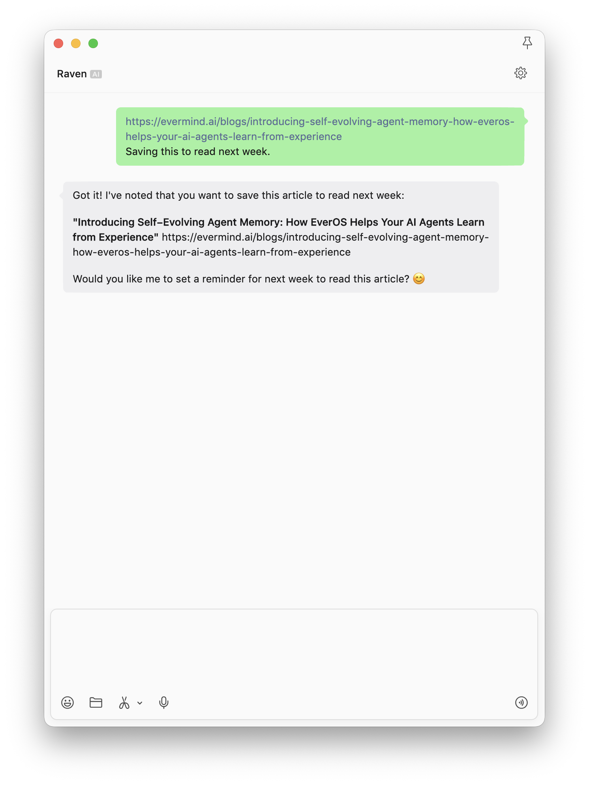
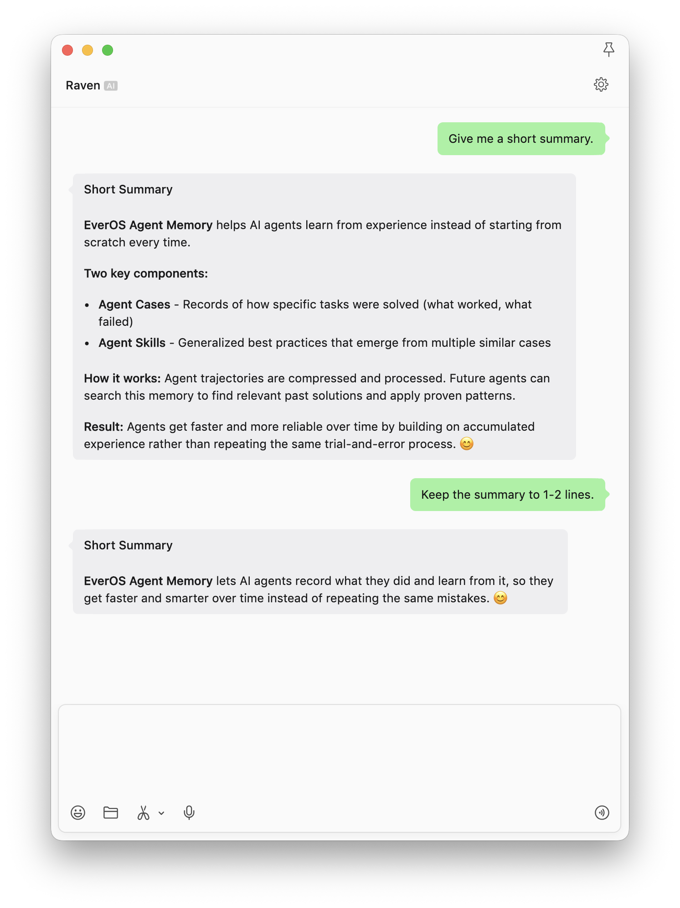
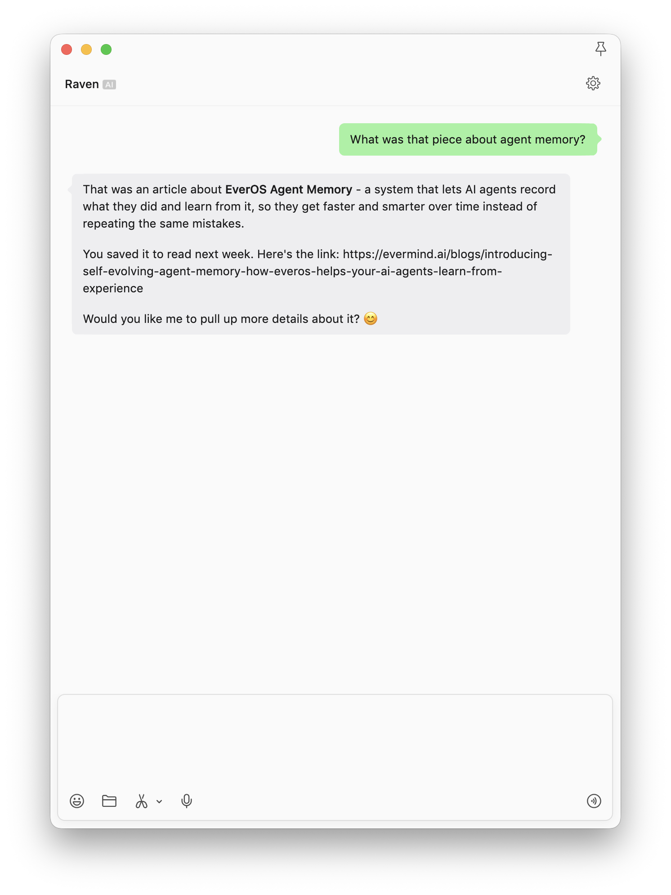

# 微信阅读管家

[English](README.md)

## 要解决的问题

微信里收到的文章很容易沉入收藏夹或聊天记录。用户可能记得文章讲了什么，却记不住
标题；手动分文件夹和打标签又很难长期坚持，单独保存一个链接也无法说明当时为什么
觉得它重要。

这个 Recipe 把 Raven 的一个微信会话变成轻量阅读收件箱。Raven 可以读取公开链接、
生成摘要、把链接和用户备注一起写入长期记忆，并在以后按照“意思”而不是精确标题找
回来。用户还可以选择创建每周阅读摘要。

## 已有实测证据

以下图片是社区提供的真实桌面端聊天截图，展示了链接保存、摘要调整和后续召回。
这些截图本身不能证明间隔了很长时间、使用了不同 Agent，或每周定时投递已经成功。

### 保存链接和阅读原因



### 调整摘要长度



### 按主题召回文章



## 前置条件

- 已安装 Raven 并配置可用的 LLM Provider。
- Raven 的长期记忆后端选择 EverOS。
- 已启用 `weixin` Channel，并连接到目标微信账号。
- 使用期间保持 Raven gateway 进程运行。
- Raven 可以联网访问需要读取的公开文章。
- 只有需要进一步搜索实时网页时才需要在 `tools.web.search.apiKey` 配置 Serper
  Key；读取用户已经给出的公开 URL 是另一项操作。

## 输入

- 一个公开文章 URL；
- 一句可选备注，说明为什么保存；
- 对摘要长度、语气、语言或不感兴趣主题的可选反馈；
- 如果创建周报：星期、时间、时区和最大文章数。

不要发送机密文档、私人链接、登录凭证或敏感个人信息，除非用户已经理解当前记忆
后端的数据存储、权限和隐私影响。

## 安装与检查

按照 Raven 官方仓库提供的命令安装：

```bash
curl -fsSL https://raven.evermind.ai/install.sh | bash
```

执行引导，选择 EverOS 作为 Memory Backend，并启用微信：

```bash
raven onboard
```

正式开始前检查配置：

```bash
raven doctor
raven plugins
raven channels list
```

`raven plugins` 应显示预期的 EverOS Memory Backend 已激活；
`raven channels list` 应显示 `weixin` 已启用。

启动 gateway，并保持进程运行：

```bash
raven gateway
```

## 工作流

### 1. 保存文章，并说明为什么重要

把公开 URL 发给微信中的 Raven 联系人。最好再加一句背景，它比只有链接的书签更容易
在以后找到和理解。

```text
https://example.com/article

保存这篇文章，下个月开始研究这个主题时再看。
```

确认 Raven 识别了文章，并保留链接和保存原因。如果页面无法访问，Raven 应明确说明
只保存了链接和备注，不能声称已经读过正文。

### 2. 请求基于正文的摘要

```text
用三个要点总结这篇文章，并写出它的主要结论。
```

摘要应基于文章正文，而不是只根据标题或 URL 猜测。正式验证时，可以再问一个只能从
正文中找到答案的事实问题。

### 3. 告诉 Raven 自己喜欢怎样的摘要

不需要修改设置文件，直接给出反馈：

```text
以后除非我要求展开，否则文章摘要保持在一至两行。
```

然后发送第二篇文章，检查 Raven 是否继续使用这个偏好。同一会话内成功修改只能证明
指令跟随；要宣称偏好被长期记住，还需要新会话测试。

### 4. 在新会话中按意思召回

结束之前的对话，新建一个 Raven 会话，不重复文章标题，只按主题提问：

```text
我之前保存的那篇关于 Agent Memory 的文章是什么？
```

成功结果应返回正确文章、URL 和当时的保存原因。如果这份证据将用于把 Recipe 升级为
`verified`，需要记录两个 Session ID 和测试日期。

### 5. 可选：创建每周阅读摘要

最可靠的方法是在应该接收摘要的同一个微信会话中直接告诉 Raven：

```text
每周六上午 10 点（Asia/Shanghai），整理我本周保存的文章，以及以前保存但没有确认
读完的文章。按主题分组，用我偏好的方式摘要，指出值得关注的关联或矛盾，最多 10 篇。
```

Raven 应确认时间和投递目标。然后在终端检查任务：

```bash
raven cron list
raven cron get <job-id>
```

需要脚本化创建时，可以使用：

```bash
raven cron add \
  --name "reading-digest" \
  --cron "0 10 * * 6" \
  --tz "Asia/Shanghai" \
  --message "从记忆中寻找我本周保存的文章，以及以前保存但没有确认读完的文章。按主题分组，用我偏好的方式摘要，指出值得关注的关联或矛盾，最多 10 篇。" \
  --yes
```

如果省略 `--channel` 和 `--to`，Raven 会在任务触发时根据
`cron.forward_channels` 和最近的 Channel Session 选择投递目标。依赖这种方式前先检查：

```bash
raven cron config get
raven channels list
```

在首次触发时间保持 gateway 运行，并确认摘要确实到达目标微信会话，才能认为自动化
配置完成。

## 预期输出

基础工作流应产生：

1. 保存的文章 URL 和用户备注；
2. 页面可以读取时，生成一份基于正文的摘要；
3. 一项可以用第二篇文章测试的摘要格式偏好；
4. 在新会话中按照主题召回原文章和链接。

可选自动化应在微信中生成不超过十篇的周报，按主题分组，并使用已经测试过的摘要
风格。本 Recipe 目前尚未附带 weekly digest 的实测截图。

## 验收清单

- [ ] `raven doctor` 没有阻塞性配置错误。
- [ ] `raven plugins` 确认目标 EverOS Memory Backend 已激活。
- [ ] `raven channels list` 显示 `weixin` 已启用。
- [ ] Raven 能区分“成功读取正文”和“只保存 URL”。
- [ ] 一个正文事实问题证明 Raven 读取了文章内容。
- [ ] Raven 在新 Session 中返回正确链接和保存备注。
- [ ] 第二篇文章验证摘要偏好是否继续生效。
- [ ] 第一份 weekly digest 到达预期微信会话。
- [ ] `raven cron get <job-id>` 显示正确时间和投递状态。
- [ ] 公开截图真实、已获授权，并且不包含敏感数据。

## 限制与安全

- 登录页、付费墙、反爬页面或重度客户端渲染页面可能无法读取。Raven 不能把只根据
  标题做出的推断描述成已读取正文的摘要。
- 网页可能更新或失效；事实准确性重要时应保留原链接和访问日期。
- 跨会话召回依赖相同的 Memory Identity 和一次成功的记忆写入。原会话中 Raven 做出
  回复，不等于已经证明长期记忆成功。
- 同一会话中遵循一次格式反馈，不代表 Raven 已经创建可复用 Procedure 或 Skill。
- 定时投递依赖持续运行的 gateway、有效收件目标，以及正确的时区和 Channel Routing。
- 文章版权仍属于原作者；应保存链接和摘要，不要在库里重新发布文章全文。

## 署名

- 作者：社区贡献者，公开姓名或账号待补。
- 原始来源：2026-08-12 审阅的未公开社区投稿。
- 截图：社区提供的真实桌面端聊天截图；公开前必须确认再分发授权。

## 官方资料

- [Raven 官方仓库](https://github.com/EverMind-AI/Raven)
- [EverOS 官方仓库](https://github.com/EverMind-AI/EverOS)
- [Raven 官方文档](https://raven.evermind.ai/)

## 当前验证状态

- 状态：`documented`
- 原始运行的 Raven 版本：未记录
- 命令核对版本：Raven v0.1.10
- 已检查证据：保存链接、调整摘要、按主题召回
- 尚未独立验证：新会话召回、偏好持续生效、周报投递和跨 Agent 访问
- 最后审阅日期：2026-08-12
- Maintainer：待指定

要升级为 `verified`，需要在干净的 Raven 环境中重新运行，记录 Raven 版本和两个
Session ID，并补充一份成功投递的 weekly digest 截图及 Cron 回执。
